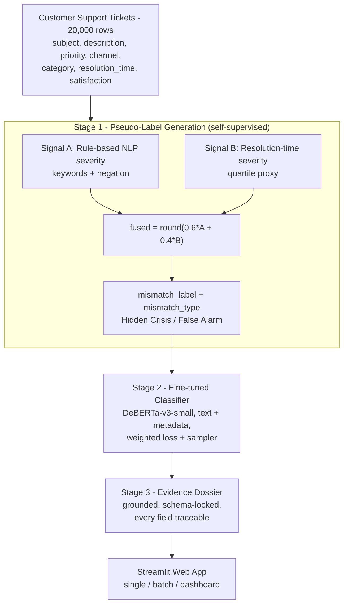

# Support Integrity Auditor (SIA)

An evidence-grounded, self-supervised auditor that detects **Priority Mismatch** in
CRM support tickets — cases where a ticket's objective characteristics (text,
channel, resolution time) conflict with its human-assigned priority.

There are **no ground-truth mismatch labels** in the data. SIA bootstraps its own
supervision signal from raw tickets, trains a fine-tuned classifier on those
pseudo-labels, and produces a **hallucination-free Evidence Dossier** for every
flagged ticket.

- **Live app:** https://support-integrity-auditor-wzezsk7w4wgftjra59vmcf.streamlit.app/
- **Dataset:** [Customer Support Tickets — CRM Dataset](https://www.kaggle.com/datasets/ajverse/customer-support-tickets-crm-dataset/data) (20,000 rows)

---

## Architecture



**Single source of truth:** all severity / text / binning / dossier logic lives in
[`sia_core.py`](sia_core.py); `train_pipeline.py`, `predict.py`, and `app.py` import
it, so training and inference are computed **identically** — no drift.

---

## Stage 1 - Pseudo-label generation (self-supervised)

Two independent signals are fused (the spec requires >= 2):

| Signal | Source field | How severity is inferred |
|---|---|---|
| **Rule-based NLP** | `Ticket_Subject` + `Ticket_Description` | Critical / High / Low keyword banks + negation -> severity 1-4 |
| **Resolution time** | `Resolution_Time_Hours` | Quartile bucket (<=Q25 -> 1 ... >Q75 -> 4) |

**Fusion:** `inferred = round(0.6 * rule + 0.4 * resolution)`, clamped to 1-4.
A ticket is a **mismatch** when the fused inference disagrees with the assigned
priority: **Hidden Crisis** (inferred > assigned, under-prioritised) or
**False Alarm** (inferred < assigned, over-prioritised).

**Why 0.6 / 0.4 (rule-weighted)?** The ablation shows the rule signal aligns far
more strongly with the final labels. In this dataset Critical tickets are actually
resolved *fastest*, so raw resolution time is a noisy, partly inverted cue — used
as a secondary corroborating signal, not a primary one.

### Ablation (reproduced in `notebook.ipynb`)

κ = Cohen's kappa vs. the final fused pseudo-labels.

| Signal combination | % flagged mismatch | κ vs. final labels |
|---|---:|---:|
| Rule only | 40.1% | 0.6559 |
| Resolution only | 79.5% | 0.0889 |
| **Rule + Res (0.6 / 0.4) — chosen** | 59.9% | **0.3579** |
| Rule + Res (0.5 / 0.5) | 65.9% | 0.2890 |

**Pseudo-Label Signal Agreement** (κ between the two raw signals) ≈ **-0.04** —
near-independent, confirming the signals contribute complementary information.

---

## Stage 2 - Fine-tuned classifier

- **Model:** `microsoft/deberta-v3-small`, fine-tuned with a fresh 2-class head
  (not a frozen zero-shot pipeline).
- **Inputs:** text + structured metadata, joined as
  `subject [SEP] description [SEP] channel [SEP] category [SEP] resolution_bin [SEP] satisfaction_bin`.
- **Class imbalance** (~25% mismatch): weighted CrossEntropy loss + WeightedRandomSampler.
- **Threshold** tuned on validation macro-F1 and saved to `feature_config.json`.

### Results (held-out test split, 2,000 tickets)

| Metric | Result | Target | Status |
|---|---:|---|:--:|
| Binary Accuracy | **0.8450** | >= 0.83 | Pass |
| Macro F1 | **0.8131** | >= 0.82 | Borderline |
| Recall (Correct) | **0.8342** | >= 0.78 | Pass |
| Recall (Mismatch) | **0.8780** | >= 0.78 | Pass |

The decision threshold and resolution-time quartiles are persisted in
`feature_config.json`, so inference reproduces the exact bins seen during training.

---

## Stage 3 - Evidence Dossier

Generated for every flagged ticket:

```json
{
  "ticket_id": "TKT-0001",
  "assigned_priority": "Low",
  "inferred_severity": "Critical",
  "mismatch_type": "Hidden Crisis",
  "severity_delta": "+3",
  "feature_evidence": [
    { "signal": "keyword", "value": "cannot access", "weight": "0.60", "field": "Ticket_Subject + Ticket_Description" },
    { "signal": "resolution_time", "value": "48.0h", "weight": "0.40", "field": "Resolution_Time_Hours", "interpretation": "1.7x median" },
    { "signal": "ticket_channel", "value": "Email", "field": "Ticket_Channel" }
  ],
  "constraint_analysis": "<grounded 2-3 sentence explanation>",
  "confidence": "0.98"
}
```

**Anti-hallucination guarantee:** every `feature_evidence` item names the exact
input field it came from; an unfired signal is reported as `"none"` — no keyword,
weight, or claim is ever invented.

---

## Repository layout

```
.
├── notebook.ipynb       Full reproducible pipeline (EDA -> pseudo-label -> train -> eval)
├── train_pipeline.py    Standalone Stage 1 + Stage 2 training script
├── predict.py           Inference: CSV in -> predictions CSV + dossiers out
├── app.py               Streamlit web app (single / batch / dashboard)
├── sia_core.py          Shared logic — single source of truth
├── fix_checkpoint.py    One-time checkpoint key migration (see note below)
├── requirements.txt     Pinned dependencies
├── data/                adversarial_tickets.csv (10 tickets crafted to fool keyword systems)
└── assets/              training curves + EDA figures
```

---

## How to run

```bash
pip install -r requirements.txt

# Train (Stage 1 + Stage 2) — needs the Kaggle CSV
python train_pipeline.py --data data/customer_support_tickets.csv --output models/deberta_final

# Batch inference + dossiers
python predict.py --input data/adversarial_tickets.csv --model models/deberta_final \
                  --output predictions.csv --dossiers outputs/dossiers

# Web app
streamlit run app.py
```

> **Model artifact:** `models/deberta_final/` (weights + `feature_config.json`) must
> be present for `predict.py` and `app.py`. Train locally, download the folder from
> the Kaggle notebook run, or load from a Hugging Face repo via `SIA_MODEL_PATH`.
>
> **transformers version:** the checkpoint runs on `transformers==4.46.3` (its
> training version); 5.x computes DeBERTa-v3 differently and yields flat ~0.5 output.
> The pinned `requirements.txt` handles this. If a checkpoint uses legacy
> `LayerNorm.gamma/beta` keys, run `python fix_checkpoint.py --model models/deberta_final` once.

---

## Web app features

- **Single Ticket** — form input -> binary judgment + full Evidence Dossier (downloadable).
- **Batch Analysis** — CSV upload -> per-ticket predictions table + downloadable CSV.
- **Dashboard** — mismatch-type distribution, assigned-priority distribution, a
  severity-delta heatmap across categories x channels, and the top flagged tickets.

**Metrics covered:** binary accuracy, macro-F1, per-class recall, and Pseudo-Label
Signal Agreement — all reproducible from `notebook.ipynb`.
